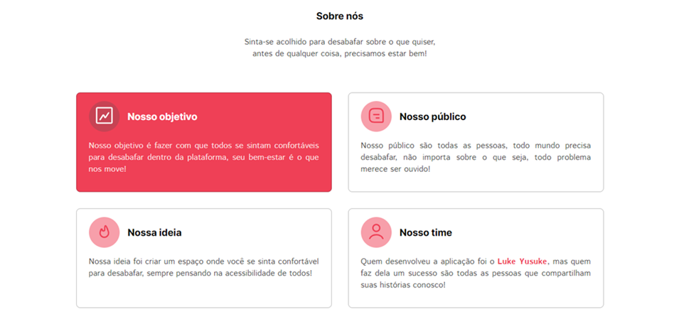

<h1 id="inicio" align="center">Pronto, Falei</h1>
<h2 align="center">Seu bem-estar é o que nos move</h2>

<div align="center">
    
</div><br/>

<p align="center">
    <b weight="bold"> Pronto, Falei </b>
    <b weight="bold">✅ Concluído </b>
</p>

<p align="center">
    <a href="#sobre">Sobre</a> •
    <a href="#paginas">Páginas</a> •
    <a href="#tecnologias">Tecnologias</a> •
    <a href="#funcionalidades">Funcionalidades</a> •
    <a href="#aprendizados">Aprendizados</a> •
    <a href="#rodando">Como executar</a> •
    <a href="#autor">Autor</a> •
    <a href="#licenca">Licença</a>
</p>

<h4 align="center">
    <a href="https://pronto-falei.vercel.app">Clique para visitar o nosso site</a> <!-- Ainda vou colocar o site no ar -->
</h4>
<br/>

<h2 id="sobre">💻 Sobre o projeto</h2>

<p> ❤️ <b>Pronto, Falei</b> - É um espaço seguro onde você pode compartilhar seus sentimentos e momentos difíceis pelos quais está passando. Nosso propósito é fornecer um espaço inclusivo para todos, onde qualquer usuário possa navegar e utilizar nossa plataforma com facilidade, pois seu  bem-estar é o que nos move </p>
<br/>

<h2 id="paginas">🗂️ Páginas</h2>

### 🏡 **Home**

- Na **Introdução** é apresentado um breve resumo do objetivo do projeto;
- Na **Sobre** é detalhado o objetivo do projeto, desde o surgimento da ideia até o nosso público-alvo;
- No **Contato** é possível enviar uma mensagem para o desenvolver da plataforma através de um formulário;

### 👤 **Login e Cadastro**

- No **Login** é possível entrar com o email e senha do usuário, possibilitando ou não acesso ao sistema;
- No **Cadastro** ocorre a criação do usuário, onde é necessário preencher todos os campos de maneira correta;

### 🥲 **Desabafos**
    
- Na **Home** dos desabafos, temos os desabafos dos usuários, além de um menu lateral e um menu dropdown que possibilita uma navegação intuitiva durante toda a página;

- Nos **Desabafos** é possível criar seu desabafo, sendo necessário o preenchimento correto de título, subtítulo e texto principal, para depois ser possível publicar o desabafo;

- No **Perfil**, é possível atualizar e/ou excluir seu usuário;

<br/>

<h2 id="tecnologias">🛠️ Dependências e Linguagens</h2>

### 🟡 Linguagens

Para a criação do Front-end foram utilizados [HTML](https://developer.mozilla.org/pt-BR/docs/Web/HTML), [SASS](https://sass-lang.com) e [JS](https://developer.mozilla.org/pt-BR/docs/Web/JavaScript). Enquanto que para o back-end foi utilizado o NodeJS 
 
### 🫁 Dependências 

- [EJS](https://ejs.co)
- [Supabase](https://supabase.com/docs)
- [Express](https://expressjs.com/pt-br/) 
- [Webpack](https://webpack.js.org)
- [Nodemailer](https://nodemailer.com)
- [Redis](https://redis.io/docs/latest/)

<br/>

<h2 id="funcionalidades"> ⚙️ Funcionalidades </h2>

[x] **Fale conosco**: Na seção de `Contato` é possível enviar uma mensagem para o desenvolvedor do projeto, através do preenchimento do formulário;

[x] **Dark/Light Mode**: Está disponível durante toda a navegação na aplicação; 

[x] **Menu lateral**: O menu lateral foi utilizado para manter Home, Desabafos e Perfil na mesma página, não tendo que alterar ou criar novas rotas, facilitando na navegação do usuário;

[x] **Menu Dropdown**: O menu dropdown foi criado para facilitar na navegação do usuário pela página, tanto na versão Desktop quanto mobile;

[x] **Cadastro e Login de usuários**: O cadastro e Login de usuários é necessário para utilização do sistema, sem a autenticação do usuário, não é possível utilizar toda a aplicação;

[x] **Criação de desabafo**: Está é a funcionalidade principal da aplicação, que te possibilita criar seu desabafo, que está disponível para visualização na aba `Home` do menu lateral;

[x] **Atualização e exclusão de usuários**: Também conseguimos atualizar os dados do usuário, além de podermos deletar nossa conta;

[x] **Saída do usuário**: É possível encerrar a sessão do usuário através deste botão;
 
<br/>

<h2 id="aprendizados">💻 Aprendizados</h2>

- Envio de email utilizando NodeMailer
- Integração do Front + Back
- Utilizando EJS
- Criação do CRUD
- Manipulação do Banco de Dados 
- Entendimento de rotas com Express
- Gerenciamento de Sessões com Redis
- Modelo MVC

<br/>

<h2 id="rodando">🚀 Como executar o projeto </h2>

### Pré-requisitos 

Antes de começar, você vai precisar ter instalado em sua máquina o [Git](https://git-scm.com) e o [Node.js](https://nodejs.org/en/). 
Além disto, é bom ter um editor para trabalhar com o código como o [VSCode](https://code.visualstudio.com/)

#### Rodando o servidor

```bash

# Clone este repositório 
$ git clone https://github.com/lukeyusuke/pronto-falei.git

# Entre na pasta do projeto no seu terminal/cmd
$ cd pronto-falei

# Instale as dependências
$ npm install

# Execute a aplicação
$ npm run dev

# O servidor inciará na porta:3000 - acesse http://localhost:3000

``` 

<br/>

<h2 id="autor">👨🏾‍💻 Autor </h2>

<table>
    <td align="center"><a href="https://www.linkedin.com/in/lukeyusuke"><br /><sub><b>Luke Yusuke</b></sub></a></td>
</table>

<p>
    <a target="_blank" href="mailto:lukedev09@gmail.com" alt="Link para Email"> 
        
    </a>
    <a target="_blank" href="https://www.github.com/lukeyusuke"> 
        
    </a>
    <a target="_blank" href="https://www.linkedin.com/in/lukeyusuke"> 
        
    </a>
</p>

<h2 id="licenca">📝 Licença</h2>

<p> Projeto feito sob licença <a href="https://github.com/lukeyusuke/pronto-falei/blob/main/LICENSE"/>MIT</a> </p>
<p> Desenvolvido por <b style="color:#9F40EB">Luke Yusuke 😁</b></p>
